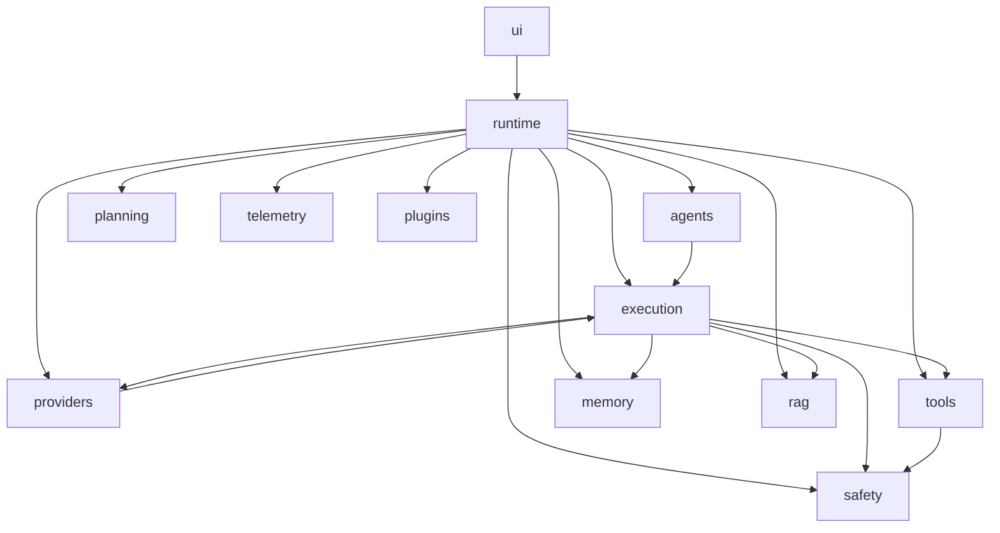
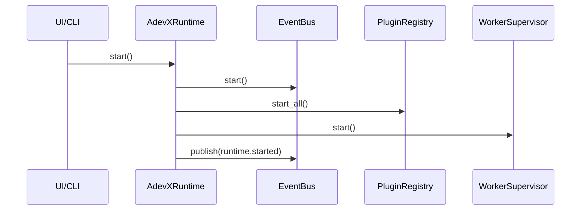
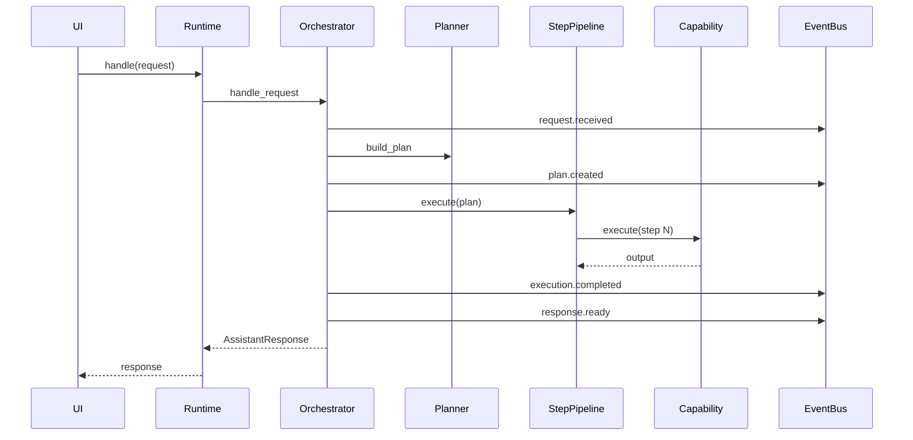
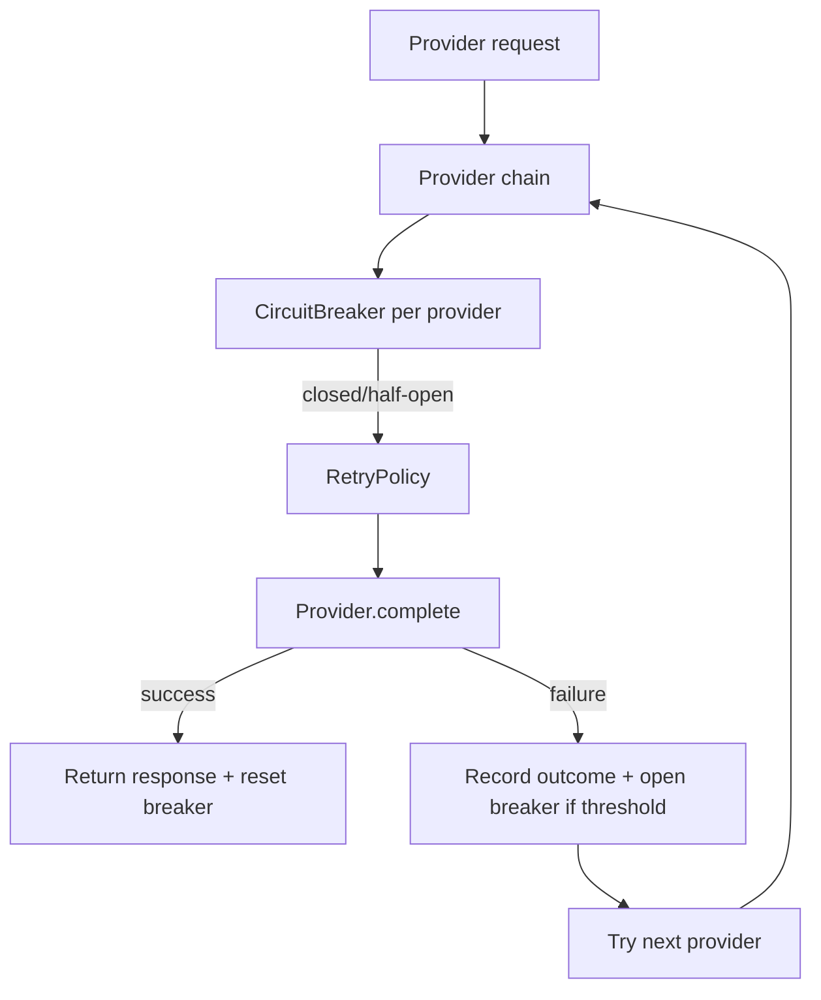

# AdevX Production Architecture Report

## 1. Executive Summary

AdevX has been refactored from a monolithic `taskbot.py` into a modular, event-driven architecture designed for:

1. Local-first operation with online provider augmentation.
2. Multi-agent concurrency and safe tool execution.
3. Enterprise reliability patterns: retries, circuit breakers, cancellation, structured telemetry.
4. Clean extension model for plugins, future GUI, voice, and distributed runtime.

The legacy monolith remains the compatibility layer during migration. New modules are under `adevx/`.

## 2. Folder Structure

```text
adevx/
  __init__.py
  main.py
  core/
    __init__.py
    capability_registry.py
    config.py
    contracts.py
    dependency_graph.py
    errors.py
    models.py
  agents/
    __init__.py
    base.py
    manager.py
    session_agent.py
  providers/
    __init__.py
    base.py
    compat_provider.py
    ollama_provider.py
    openai_provider.py
    policies.py
    router.py
  memory/
    __init__.py
    base.py
    json_store.py
  rag/
    __init__.py
    index.py
    retriever.py
  tools/
    __init__.py
    base.py
    builtin_tools.py
    registry.py
  runtime/
    __init__.py
    app.py
    bootstrap.py
    cancellation.py
    context.py
    event_bus.py
    workers.py
  ui/
    __init__.py
    cli.py
    stream.py
  telemetry/
    __init__.py
    logger.py
    metrics.py
    tracing.py
  safety/
    __init__.py
    policies.py
    shell_guard.py
  planning/
    __init__.py
    graph.py
    planner.py
  execution/
    __init__.py
    capabilities.py
    circuit_breaker.py
    orchestrator.py
    phase_runner.py
    pipeline.py
    retries.py
  plugins/
    __init__.py
    base.py
    registry.py
docs/
  ARCHITECTURE_REPORT.md
```

## 3. Architectural Principles

1. Strict separation of concerns:
   `planning != execution != provider IO != tools != memory`.
2. Event-driven orchestration:
   runtime publishes lifecycle and domain events.
3. Contract-first design:
   all major services described via protocols in `core/contracts.py`.
4. Local-first reliability:
   memory and RAG persist locally by default.
5. Compatibility-first migration:
   current `taskbot` tool implementations are wrapped during transition,
   while modular RAG now uses native incremental semantic indexing.

## 4. Dependency Graph

### 4.1 Layered View



### 4.2 Module Dependency Contract

Defined in `core/dependency_graph.py` as a machine-readable map for validation.

## 5. Execution Lifecycle

### 5.1 Runtime Lifecycle



### 5.2 Request Lifecycle



## 6. Request Pipeline

1. Ingress:
   `UserRequest(text, mode, session_id)` enters runtime.
2. Safety gate:
   prompt policies can block malformed or unsafe requests.
3. Planning:
   `HeuristicPlanner` emits an `ExecutionPlan` with ordered steps.
4. Orchestration:
   `StepPipelineExecutor` dispatches capabilities from registry.
5. Retrieval and memory:
   capabilities enrich context with local memory and RAG snippets.
6. Provider route:
   `ProviderRouter` selects providers with retry + circuit breaker.
7. Verification:
   post-step validation capability runs.
8. Egress:
   consolidated `AssistantResponse`.
9. Telemetry:
   events and metrics emitted throughout.

## 7. Tool-Calling Pipeline


### Tool Pipeline Reliability

1. Tool names are resolved through registry only.
2. Unknown tools return structured failure.
3. Shell command paths enforce guard checks before execution.
4. Tool outputs are deterministic strings for easy downstream verification.

## 8. Provider Fallback Pipeline



### Reliability Controls

1. Exponential backoff retries with jitter.
2. Circuit state transitions: `closed -> open -> half_open -> closed`.
3. Outcome capture includes latency and error details.
4. Full chain error surface for diagnostics.

## 9. Streaming Architecture

Current scaffold:

1. `ui/stream.py` supports async chunk rendering.
2. Providers expose `stream_complete` protocol.
3. Runtime can be upgraded to publish `response.chunk` events.

Target production extension:

1. Provider adapters emit token chunks.
2. Event bus broadcasts `response.chunk`.
3. UI renders chunks in real time.
4. Final chunk marks completion and persists final transcript.

## 10. Async Event System

`runtime/event_bus.py` provides:

1. Async queue-backed dispatch loop.
2. Named event subscriptions.
3. Wildcard subscribers for telemetry and debugging.
4. Fault isolation so handler errors do not crash the bus.

Core event types already used:

1. `runtime.started`
2. `runtime.stopping`
3. `request.received`
4. `plan.created`
5. `execution.completed`
6. `response.ready`

## 11. Class Hierarchy and Interfaces

### 11.1 Key Runtime Classes

1. `AdevXRuntime`:
   lifecycle owner and request facade.
2. `ExecutionOrchestrator`:
   controls plan build + pipeline run + event publication.
3. `StepPipelineExecutor`:
   executes plan steps through capability registry.
4. `ProviderRouter`:
   resilient provider fallback and routing.
5. `AgentStateManager`:
   multi-agent status and concurrency coordination.

### 11.2 Protocol Contracts (`core/contracts.py`)

1. `EventBus`
2. `ChatProvider`
3. `Planner`
4. `CapabilityExecutor`
5. `Tool`
6. `MemoryStore`
7. `Retriever`
8. `Plugin`
9. `TelemetrySink`
10. `CapabilityRegistry`

## 12. Startup Boot Sequence

1. Load `RuntimeConfig.from_env`.
2. Build logger and event bus.
3. Attach telemetry sink to event bus.
4. Initialize local memory store.
5. Initialize RAG index/retriever adapter.
6. Build tool registry with safety-guarded shell tool.
7. Build provider instances and `ProviderRouter`.
8. Register capability executors.
9. Construct planner + step pipeline + orchestrator.
10. Construct runtime context and runtime facade.

## 13. Local-First and Offline Resilience Design

1. Memory persists in local JSON.
2. RAG retrieval is local workspace indexed.
3. Ollama provider is first-class in provider chain.
4. Tool operations run against local workspace.
5. Provider chain supports graceful cloud degradation.

## 14. Concurrent Agents and Future Distributed Execution

### Current

1. `AgentStateManager` tracks status and bounded concurrency.
2. Runtime semaphore enforces max concurrent requests.
3. Event bus enables decoupled background processors.

### Next

1. Move from single `primary` agent to dynamic pool.
2. Add per-agent cancellation tokens and deadlines.
3. Externalize queue transport for distributed workers.
4. Introduce remote executor interface for cross-machine plans.

## 15. GUI and Voice Readiness

1. UI abstraction is isolated in `ui/`.
2. Streaming renderer supports tokenized output upgrade.
3. Event bus can feed GUI panels:
   timeline, plan graph, tool logs, provider diagnostics.
4. Voice support path:
   add `audio_in` and `audio_out` capabilities with same orchestration.

## 16. Migration Plan from `taskbot.py`

### Phase 0: Compatibility Baseline

1. Keep `taskbot.py` as production path.
2. Wrap existing tool functions from modular adapters.
3. Keep modular/runtime RAG local-first and independently evolvable.
4. Validate zero regression in slash commands.

### Phase 1: Runtime Side-by-Side

1. Run `python -m adevx.main` for modular runtime pilot.
2. Mirror key flows:
   chat, coding, image metadata, file tools, memory, RAG retrieval.
3. Compare response/latency metrics between old and new paths.

### Phase 2: Provider Adapter Migration

1. Replace scaffold provider responses with real API clients.
   Status: Completed for OpenAI-compatible chat-completions path
   (OpenAI/OpenRouter/Groq/Together/Ollama via `providers/http_compat.py`).
2. Add full tool-calling translation in provider adapters.
3. Maintain fallback parity with existing chain behavior.

### Phase 3: Planner/Executor Hardening

1. Replace heuristic planner with model-assisted planning.
2. Add DAG scheduler for parallelizable steps.
3. Add execution checkpoints and resumability.

### Phase 4: Production Cutover

1. Route CLI to modular runtime by default.
2. Keep monolith behind feature flag as fallback.
3. Deprecate direct `taskbot` internals after acceptance period.

## 17. Scalability Strategy

1. Horizontal scale:
   external event transport and worker queue.
2. Vertical scale:
   provider-specific async pools and batch request coalescing.
3. Memory scale:
   swap JSON to SQLite/Postgres and vector DB.
4. Telemetry scale:
   plug OpenTelemetry exporters and centralized logs.
5. Plugin scale:
   sandboxed plugin process model with capability permissions.

## 18. Enterprise Reliability Controls

1. Retry policy with jitter and bounded attempts.
2. Circuit breakers per provider.
3. Cancellation token propagation.
4. Structured logging envelope for all major operations.
5. Event-based observability hooks for tracing and metrics.

## 19. Anti-Patterns to Avoid

1. Reintroducing monolithic god-objects that combine planning, routing, and tool IO.
2. Direct tool execution from UI without orchestration and safety checks.
3. Hardcoding provider logic inside planner.
4. Blocking sync IO in async hot paths without `to_thread`.
5. Silent exception swallowing without telemetry.
6. Plugin code writing directly into core runtime internals.
7. Mixing mutable global state across agents.
8. Skipping cancellation propagation in long tasks.

## 20. Immediate Next Steps

1. Implement real provider SDK clients in `providers/`.
2. Add integration tests for request, tool, and fallback pipelines.
3. Add streaming event types and GUI-ready event consumers.
4. Add persistent agent/session store.
5. Add policy-driven permission model for plugin and tool scopes.

## 21. Production Hardening Update - June 21, 2026

This pass strengthened production readiness without changing public commands, provider configuration, RAG behavior, or memory formats.

Implemented hardening:

1. Centralized secret redaction for provider and CLI errors.
2. Private/local URL fetch blocking by default.
3. Expanded dangerous shell command blocking.
4. Atomic local JSON writes for memory/progress stores.
5. Provider retry filtering for permanent failures.
6. Circuit-open handling that avoids unnecessary failure amplification.
7. Bounded `/agent execute` runtime through `ADEVX_AGENT_TIMEOUT`.
8. Bounded retrieval query cache with index-change invalidation.

Architecture principle:

The stable CLI remains compatible, while production behaviors are pushed into shared helpers where possible. This keeps AdevX usable today and still moves it toward the modular runtime target.

Remaining architecture priorities:

1. Persistent job queue for resumable agent execution.
2. Unified command bus shared by `taskbot.py` and `adevx.ui.cli`.
3. Persistent observability and audit log.
4. Encrypted local secret storage.
5. RAG quality evaluation fixtures.
