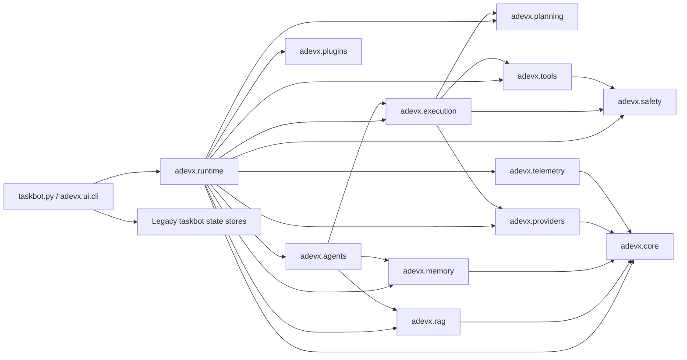
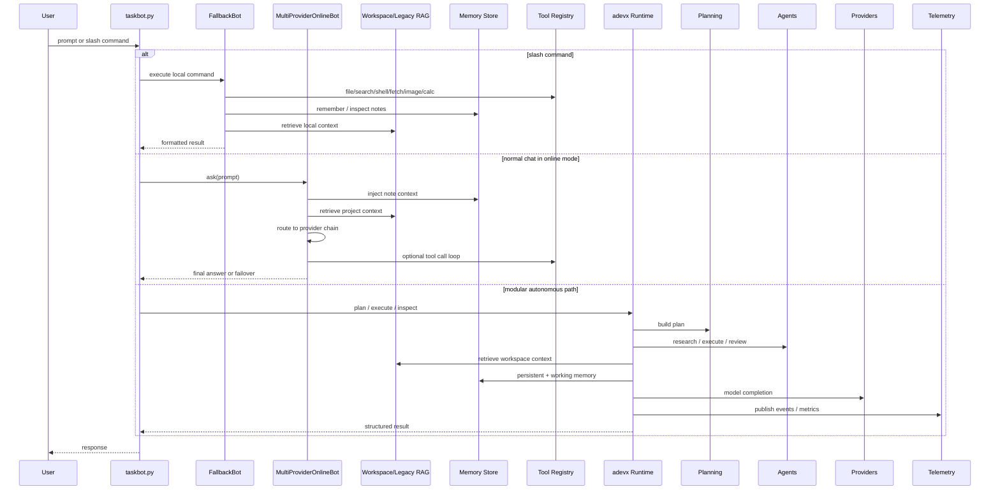

# AdevX Next Phase Analysis

As of June 8, 2026, this document captures the architecture analysis that precedes the next implementation phase. The goal is to evolve AdevX without rewriting it, while preserving CLI behavior, commands, providers, memory files, RAG behavior, tests, configuration, and existing APIs.

## Scope Baseline

- 82 tracked files
- 76 Python files
- terminal-first entrypoint in `taskbot.py`
- modular runtime in `adevx/`
- existing multi-provider routing and failover
- online/offline execution
- persistent memory
- hybrid RAG with incremental indexing
- planner, orchestrator, event bus, autonomous scaffolding
- Ollama local integration
- GitHub Actions CI

## Dependency Graph

## Runtime Interaction Graph

## Module Responsibility Report

| Module | Current responsibility | Notes |
|---|---|---|
| `taskbot.py` | Stable user-facing CLI, provider selection, offline commands, legacy memory/RAG/tool flow | Most user traffic still lands here |
| `adevx.core` | Config, contracts, dependency metadata, domain models | Good base, still light on shared service abstractions |
| `adevx.runtime` | Bootstrapping, runtime context, event bus, worker supervisor | Useful composition layer, currently underused by the main CLI |
| `adevx.providers` | OpenAI-compatible provider adapters, Ollama, routing, retries, circuit breaking | Good production direction |
| `adevx.memory` | Modular JSON memory, scratchpad, working memory, long-term retrieval | Weaker than taskbot UX in some places, stronger structurally |
| `adevx.rag` | Incremental workspace indexing and hybrid retrieval | Strong foundation, missing deeper repo intelligence |
| `adevx.planning` | Heuristic planner, goal decomposition, tree-of-thought planning | Good scaffolding, not yet fully exposed to end users |
| `adevx.execution` | Orchestrator, autonomous engine, pipeline, reflection, retries | Strong backbone, needs more end-user command wiring |
| `adevx.agents` | Planner/research/executor/reviewer role agents | Real role separation exists already |
| `adevx.telemetry` | Structured logger, metrics sink, tracing stub | Metrics exist, tracing is still mostly placeholder |
| `adevx.tools` | Built-in tool registry and execution | Stable and already useful |
| `adevx.safety` | Shell guard and execution policy checks | Important for local-first safety |
| `docs/` | Architecture and autonomous design docs | Good base, needs next-phase implementation docs |

## Architectural Bottlenecks

1. `taskbot.py` and `adevx/` both implement platform concerns.
   The monolith still owns the real CLI experience, while the modular runtime owns the cleaner architecture. This creates duplicated product surfaces and slows down feature rollout.

2. Legacy and modular state are split.
   `taskbot.py` uses `.adevx_memory.json` and its own `ProjectRAGStore`, while the modular runtime uses `.adevx_memory_modular.json` and `WorkspaceIndexAdapter`. The split is survivable, but it raises drift risk.

3. Repository intelligence stops at chunk-level retrieval.
   Current retrieval is good for chunk lookup, but it does not fully understand symbols, references, call relationships, or import impact.

4. The autonomous engine is real but underexposed.
   Planner, research, reflection, and checkpoint systems exist, but there is no strong user-facing command layer that makes them feel like a first-class agent platform.

5. Observability is incomplete.
   Structured logs and an event-counting metrics sink exist, but there is no user-facing metrics command, retrieval benchmark, or provider benchmark flow yet.

## Technical Debt

1. Duplicate memory systems.
   `taskbot.py::MemoryStore` and `adevx.memory.JsonMemoryStore` overlap in purpose but not structure.

2. Duplicate RAG systems.
   `taskbot.py::ProjectRAGStore` and `adevx.rag.WorkspaceIndexAdapter` both index the workspace differently.

3. Two command surfaces.
   `taskbot.py` slash commands and `adevx.ui.cli` runtime flow do not yet share one command bus.

4. Partial production hardening.
   Retry and circuit breaker logic exist in modular providers, but not all higher-level command paths expose the same telemetry and benchmarking.

5. Placeholder telemetry components.
   `adevx.telemetry.tracing` is currently a lightweight span helper, not full tracing infrastructure.

## Dead Code Or Low-Usage Code Candidates

These are not necessarily wrong; they are simply weakly connected today and should either be integrated or kept explicitly as future scaffolding.

1. `adevx.telemetry.tracing.py`
   Present but not materially wired through the runtime.

2. `adevx.ui.stream.py`
   Streaming renderer abstraction exists, but the stable CLI path still renders synchronously through `taskbot.py`.

3. `adevx.agents.session_agent.py`
   Valid abstraction, but the default runtime path does not rely on it heavily.

4. `adevx.core.dependency_graph.py`
   Useful metadata, but currently static and not generated from live analysis.

5. Plugin registry lifecycle.
   `PluginRegistry` is instantiated and started in the modular runtime, but there is not yet strong plugin-facing product behavior in the stable CLI.

## Duplicated Logic

1. Provider-facing chat history and tool-loop logic exists in `taskbot.py`, while modular providers handle a cleaner abstraction in `adevx.providers`.

2. Workspace indexing exists in both the legacy `ProjectRAGStore` and modular `WorkspaceIndexAdapter`.

3. Memory persistence and retrieval are implemented twice with different storage shapes.

4. Status and health reporting are stronger in the monolith than in the modular runtime command surface.

## Retrieval Weaknesses

1. No first-class AST graph in retrieval.
2. Symbol lookup is shallow and mostly chunk-based.
3. No reference graph or call graph for repo-wide reasoning.
4. Limited query expansion and decomposition.
5. No reranking beyond lexical/semantic hybrid heuristics.
6. Context compression is mostly truncation, not relevance-preserving summarization.

## Memory Weaknesses

1. Legacy memory is mostly a flat notes list.
2. Modular memory is session-based but thin on consolidation and pruning.
3. No strong split between episodic, semantic, project, and conversation memory.
4. No user-facing memory analytics commands.
5. Long-term retrieval is overlap-based and does not yet use richer ranking signals.

## Improvement Roadmap

### Phase A — Repository Intelligence

- Add Python AST parsing with safe fallback parsing for other languages.
- Extend indexing with symbols, imports, calls, and references.
- Preserve current chunk index and incremental updates.
- Expose:
  - `/repo symbols`
  - `/repo graph`
  - `/repo explain <symbol>`
  - `/repo references <symbol>`

### Phase B — Advanced Retrieval

- Preserve existing retrieval interface.
- Add optional advanced pipeline:
  - BM25
  - vector retrieval
  - hybrid ranking
  - reranking
  - query expansion
  - query decomposition
  - context compression
- Automatic fallback to current retrieval.

### Phase C — Memory Architecture

- Preserve old memory files and commands.
- Add episodic, semantic, project, and conversation layers.
- Add ranking, pruning, and consolidation.
- Expose:
  - `/memory stats`
  - `/memory search <query>`
  - `/memory consolidate`

### Phase D — Agent Framework

- Keep existing autonomous engine.
- Surface existing planner/research/executor/reviewer flow as first-class commands.
- Add memory-aware agent support.
- Expose:
  - `/agent plan <goal>`
  - `/agent execute <goal>`
  - `/agent review <text>`

### Phase E — Git Intelligence

- Add repository analysis, commit summarization, branch/range impact analysis.
- Reuse repo intelligence where possible.
- Expose:
  - `/git analyze`
  - `/git summarize [rev]`
  - `/git impact [path|rev-range]`

### Phase F — Production Hardening

- Expose structured metrics snapshots.
- Add retrieval and provider benchmarks.
- Improve command-level error handling and diagnostics.
- Expose:
  - `/benchmark`
  - `/metrics`

### Phase G — Test Coverage

- Add tests for repo intelligence.
- Add tests for advanced retrieval fallback.
- Add tests for memory ranking/consolidation.
- Add tests for git intelligence.
- Add tests for agent plan/review paths.

## Recommended Implementation Principle

Do not collapse the monolith into the modular runtime in one step. Instead:

1. Add new capabilities inside `adevx/` where shared logic belongs.
2. Surface those capabilities through `taskbot.py` as thin commands.
3. Preserve legacy stores and command behavior.
4. Use compatibility wrappers rather than configuration-breaking rewrites.

That path gives AdevX better intelligence and stronger architecture without breaking its current public behavior.
